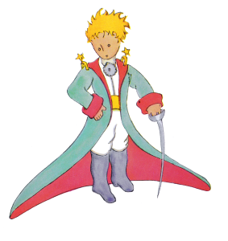

## About Me

My name is Chen Wei-Ren (陳韋任). I am interest in programming language ([C](http://www.open-std.org/jtc1/sc22/wg14/www/docs/n1124.pdf), [C++](https://isocpp.org/), [Python](https://www.python.org/) and [Scala](http://www.scala-lang.org/)), compiler ([GCC](https://gcc.gnu.org/) and [LLVM](https://llvm.org/)) and virtualization
([QEMU](https://www.qemu.org/)). I occasionally lurk in #llvm on [oftc](https://www.oftc.net/) and #gcc on [freenode](http://freenode.net/) as chenwj.

In my spare time, I like reading and traveling.

## What I Read
  - [A Conversation about Teaching Software Engineering](https://blog.regehr.org/archives/1569)

## Articles
  - [例外處理概觀](https://github.com/azru0512/slide/blob/master/MISC/ExceptionHandling-00.md)

## Travel
  - 2017 Huawei Canada Research Center - Toronto, Canada
  - 2016 Huawei America Research Center - San Jose, CA, US
  - 2016 CGO and EuroLLVM Developers' Meeting - Barcelona, Spain
  - 2014 Honeymoon - Turkey
  - 2013 Self-service Trip - Jeju, South Korea
  - 2013 MCLinker and LLVM CGO Tutorial - Shenzhen, China
  - 2012 HelloGcc WorkShop China - Beijing, China
  - 2012 LinuxCon Japan - Yokohama, Japan
  - 2011 LLVM Developers' Meeting - San Jose, CA, US
